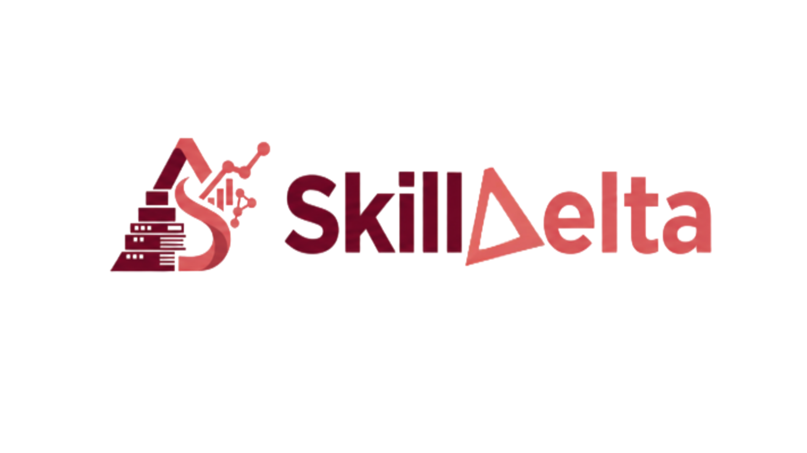

  

# SkillDelta — Curriculum evolved by AI, Validated by industry.

<!--  -->

---

<!--  -->

<!-- --- -->

## 📖 About

SkillDelta is an AI/ML-powered curriculum intelligence platform that identifies the gap between academic education and evolving industry requirements.

It analyzes university syllabi, extracts important skills and topics, compares them with industry demand, and generates clear insights about covered, partially covered, missing, and emerging skills.

SkillDelta helps students, educators, and institutions understand whether academic curricula are aligned with the skills required in the modern workplace.

---

## ⚡ Built With

---

## ✨ Features

<table>
<tr>
<td width="50%">

### 🎓 Curriculum Analysis

- 📄 Upload university syllabi
- 📚 Extract subjects and topics
- 🧠 Identify relevant skills
- 🔍 Normalize similar concepts
- 🗂️ Generate structured skill maps

</td>
<td width="50%">

### 🏢 Industry Intelligence

- 💼 Analyze industry-relevant skills
- 📈 Identify high-demand technologies
- 🆕 Detect emerging skills
- 🔗 Compare curriculum with industry needs
- 📊 Calculate curriculum alignment

</td>
</tr>
<tr>
<td width="50%">

### 🤖 AI/ML-Powered Insights

- 🧮 Semantic skill matching
- 📏 Curriculum-industry gap scoring
- 🔎 Evidence-based retrieval
- 💡 AI-generated recommendations
- 📝 Explainable analysis reports

</td>
<td width="50%">

### 📊 Skill Gap Dashboard

- ✅ Covered skills
- ⚠️ Partially covered skills
- ❌ Missing skills
- 🚀 Emerging industry skills
- 📌 Priority improvement areas

</td>
</tr>
</table>

---

## 👥 Authors

| Name       | GitHub                                           | Email                                                                                                                             |
| ---------- | ------------------------------------------------ | --------------------------------------------------------------------------------------------------------------------------------- |
| Jit Hazra  | [@Jit-codes-ez](https://github.com/Jit-codes-ez) |   |
| Saini Paul | [@Saini-Codes](https://github.com/Saini-Codes)   |  |

---

### ⭐ Show Your Support

If you found this project useful, consider giving it a star — it helps a lot!

---
